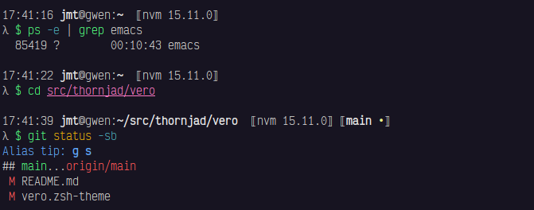

<p align=center></p>

A theme for [Oh My ZSH shell](https://github.com/robbyrussell/oh-my-zsh), created for simplicity, neatness and availability of information.

Features:

- Current Node.js version
- Git branch and status
- Timestamp
- SSH detection
- Current user
- Current working directory
- A fancy lambda symbol

## Preview

<p align=center></p>

A preview of Vero using Oh My ZSH and [Alacritty](https://github.com/jwilm/alacritty)

## Requirements

- ZSH
- A ZSH framework like [Oh My ZSH](https://github.com/robbyrussell/oh-my-zsh), [antigen](https://github.com/zsh-users/antigen), [zplug](https://github.com/zplug/zplug) or [zgen](https://github.com/tarjoilija/zgen)

## Installation

### Using Oh My ZSH!

1. Download and install the theme:

```bash
wget https://github.com/Raindeer44/vero/archive/v1.0.4.tar.gz
tar -xzvf v1.0.4.tar.gz
cp vero-1.0.4/vero.zsh-theme ~/.oh-my-zsh/themes/custom/vero.zsh-theme
```

If there are problems with missing directories in the `cp` command, make sure you have Oh My Zsh installed, then try `mkdir ~/.oh-my-zsh/themes/custom`.

2. Set vero as your ZSH theme. In your **~/.zshrc**:

```bash
ZSH_THEME="vero"
```

### Using Antigen

```bash
antigen bundle raindeer44/vero
```

### Using ZGen

If you're using [zgen](https://github.com/tarjoilija/zgen), add the following line to your **~/.zshrc** near your other ZSH plugins **after** the line `zgen oh-my-zsh`.

```bash
zgen load raindeer44/vero vero master
```

### Using ZPlug

If you're using [zplug](https://github.com/zplug/zplug), add the following line
to your **~/.zshrc** where you're adding your other zsh plugins **after** the
line `zplug "robbyrussell/oh-my-zsh"`.

```bash
setopt prompt_subst
zplug "raindeer44/vero", as:theme, use:vero.zsh-theme
```
